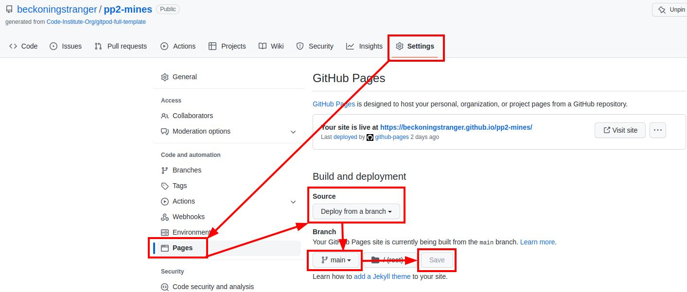
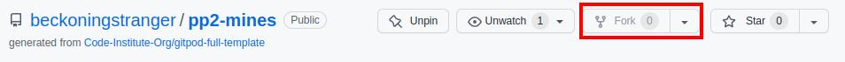

# Minesweeper

This is a site that allows users to play Minesweeper, a simple logic game that I personally learned back in the days of Windows 3.1. Minesweeper is a logic game that also involves some guesswork. The aim of the game is to uncover the whole playing field without stepping onto a mine.

Take a look at the deployed website: <a href="https://https://beckoningstranger.github.io/pp2-mines/index.html" target="_blank" rel="noopener">Minesweeper</a>.

# Contents

* [**User Experience UX**](#user-experience-ux)
  * [User Stories](#user-stories)
  * [Design](#design) 
    * [Site Structure](#site-structure)
    * [Color Scheme](#color-scheme)
    * [Typography](#typography)
    * [Wireframes](#wireframes)
* [Features](#features)
  * [Existing Features](#existing-features)
    * [Random playing field generation](#random-playing-field-generation)
    * [Main Menu](#main-menu)
    * [Difficulty Menu](#difficulty-menu)
    * [Customize Difficulty Settings Menu](#customize-difficulty-settings-menu)
    * [How to Play Section](#how-to-play-section)
    * [Settings Menu](#settings-menu)
    * [Playing Field](#playing-field)
    * [Future Implementations](#future-implementations)
      * [Reveal zero squares automatically](#reveal-zero-squares-automatically)
      * [Leaderboards](#leaderboards)
      * [Statistics](#statistics)
  * [Accessibility](#accessibility)
* [Technologies Used](#technologies-used)
  * [Languages Used](#languages-used)
  * [Frameworks, Libraries & Programs Used](#frameworks-libraries--programs-used)
* [Testing](#testing)
* [Deployment](#deployment)
  * [How to Deploy the Project on GitHub Pages](#how-to-deploy-the-project-on-github-pages)
  * [How to Fork the Repository on GitHub](#how-to-fork-the-repository-on-github)
  * [How to Clone the Repository on GitHub](#how-to-clone-the-repository-on-github)
* [Credits](#credits)
  * [Content](#content)
  * [Media](#media)
  * [Code](#code)
* [Acknowledgements](#acknowledgements)

# User Experience UX

## User Stories

  * As a user, I want to learn how the game works.

  * As a user, I want to play Minesweeper in a difficulty setting fitting my skill level so that I won't feel frustrated while playing.

  * As a user, I want to customize the look of the game so that it's pleasing to the eye.

  * As a user, I want to see how long it takes me to win a game so that I can track my performance and see whether I'm getting faster.

  * As a user, I want to see how many mines there are left to find so that it helps me to make informed decisions during the final phase of the game.

  * As a user, I want the ability to mark and unmark squares as mines so that it's easier for me to make quick decisions during the game.

  * As a user, I want the ability to quickly restart my game without having to go through the initial menus. Losing happens frequently, so I don't want to waste time.

  [Back to top](<#contents>)

## Design

### Site Structure

  The website consists of one page that is divided into several sections out of which only one is shown at the same time. Users always start in the main menu, from where they can start a game, learn how to play the game or customize their settings.
  After clicking the 'Start game' button, they can pick a difficulty level or customize their difficulty level by configuring the dimensions of the playing field and the number of mines it contains. From there, they will go to the actual game.
  Clicking the 'How to play' and 'Settings' buttons will take them to these menus respectively.
  From all pages, they can navigate back to the main menu.

  [Back to top](<#contents>)

### Color Scheme

  

  All of these color were picked because they work well with the black font. The colors for the :hover and :active effects give users feedback without getting in the way.

  [Back to top](<#contents>)

### Typography

  Google Fonts was used for the following fonts:

  * Bangers is used everywhere except for the emoji over the playing field. I picked it for its gamey vibe.

  * Space Mono is used for the emoji because it looks like a terminal font, where emojis like this could be used.

  [Back to top](<#contents>)

### Wireframes

  I planned the UI of this project on a whiteboard in my office. As the menus don't require a lot of space, I did not create special wireframes for mobile, the game looks the same almost everywhere. The playing field is the only place where space is precious and I style it with Javascript by looking at the available viewport size and sizing elements based on that.

  
  

  [Back to top](<#contents>)

# Features

## Existing Features

### Random playing field generation

* The playing field is generated automatically and mines are placed in random spots, so that every game is different and a new challenge.

### Main Menu

  * This menu lets users start games and navigate to both the 'How to play' and the 'Settings' sections.
  * Users on devices with attached pointing devices will see a hovering effect for clickable elements.

  

[Back to top](<#contents>)

### Difficulty Menu

  * In this menu users can pick the difficulty level of their choice, navigate to the customize difficulty settings menu or go back to the main menu.

    

  * On viewports with less than 1024px width, the hard and custom difficulty options are hidden. Hard would definitely break the layout and custom options have a high chance of doing that as well, as narrow viewports can't handle more than 8 columns of squares. Beginners will be satisfied with the lower difficulty levels.

    

  [Back to top](<#contents>)  

### Customize Difficulty Settings Menu

  * Here users can customize the playing field by adjusting the parameters of its height and width. 
  * They can also configure the number of mines that will be in the playing field.
  * After they are done, they can start the game by clicking the 'Start Playing' button.
  * If they would rather pick one of the pre-defined settings, they can go back to the main menu and restart from there.

  

  [Back to top](<#contents>)

### How To Play Section

  * Here users can learn what Minesweeper is and how to play the game.

  * The two clickable buttons at the top of the playing field are also briefly explained. They are the only elements that are not completely straightforward.

  * At the bottom of the page users can also see what it looks like to win and lose a game.

  

  [Back to top](<#contents>)

### Settings Menu

  * Here users can activate Desktop Mode, which just prevents the playing field from being resized with respect to their viewport. Users who know the game from the olden days might want to prefer the squares never to vary in size. This is deactivated by default because the resizing feature is essential on mobile devices.
  * Users can also pick a different background color that they might prefer to the standard greyish blue.

  

  [Back to top](<#contents>)

### Playing Field
  
  * On the playing field there is a circle arrow at the top left. By clicking it, users can quickly restart their games. This is essential because clicking a mine and losing in the process is such a frequent part of the game.
  * The timer starts counting as soon as a game is started. It only stops once the player either loses or wins.
  * The ^\_^ emoji indicates that the game is still going on. It temporarily changes to O\_O when the player is clicking a mine, which conveys a certain tension as every click is potentially the end of the game. Once players lose, it changes to X\_X indicating that the player is dead and to d^\_^b when they win to indicate a double thumbs up, acknowledging the player's feat. All of this was heavily inspired by the original game that had a graphical emoji with similar expressions.
  * The mines counter shows the number of mines players have left to find. Every time a player marks a square as mined by right-clicking or long-pressing it, the counter goes down. As in the original game, it is not a clear indicator of whether the marked squares really contain mines, it does not perform a check. It simply serves as an indicator of the player's progress and can help with decisions late in the game when the player can evaluate how many mines there are in the last remaining squares. This can be helpful.
  * The off button allows players to navigate back to the main menu.
  * Every square on the playing field has a hover effect and an active effect for more feedback.
  * The numbers that players reveal by clicking or tapping squares are color-coded to help players make faster decisions.
  * When a game is lost, the background of the playing field will turn red, when the player wins, it turns green. This is different from the original game but gives additional feedback.
  * When the game ends, all mines are revealed as their squares will show in black.

  
  
  

  [Back to top](<#contents>)

## Future Implementations

### Reveal zero squares automatically

  *  When you click a square that does not border on any mined squares (zero square), the game should automatically reveal all adjacent squares and do the same if it finds any more zero squares in the process. This would mimick the original game's behavior.

### Leaderboards

  * Record times and player names for won games in leaderboards for the standard difficulty levels.

### Statistics
  
  * Create statistics like 'x games won out of x attempts' or 'percentage of revealed squares before losing'.

[Back to top](<#contents>)

## Accessibility

I have tried to keep the website as accessible as possible by using semantic HTML elements, providing adequate contrast for fonts, using the alt attribute for images, the title attribute for links, etc. To further ensure that the site is accessible, I ran tests with the Web Accessibility Evaluation Tool (WAVE) and also used a Chrome browser extension called Web Disability Simulator. More on this in [Testing](#testing).

[Back to top](<#contents>)

# Technologies Used

## Languages Used

  * HTML5
  * CSS3
  * Javascript

## Frameworks, Libraries & Programs Used

  * [Git](https://git-scm.com/) - For version control

  * [GitHub](https://github.com) - To save and store my project files

  * [Google Fonts](https://fonts.google.com/) - To find and import fonts

  * [CloudConvert](https://cloudconvert.com/) - To convert PNG images to WebP images and GIF to WebM animations

  * [Colordot](https://color.hailpixel.com/) - To create the color palette above

  * [Favicon.io](https://favicon.io/) - To create a favicon

  * [Font Awesome](https://fontawesome.com/) - For the Restart and Off Button icons

  * [Google Dev Tools](https://developer.chrome.com/docs/devtools/) - To work out bugs, troubleshoot and test features and play around with property values and to test the website using the Lighthouse Test

  * [Compressor.io](https://compressor.io) - To compress images

  * [GIMP](https://gimp.org) - To resize and convert images

  * [ScreenToGif](https://www.screentogif.com/) - To record gameplay for the How to Play section and animations for the documentation of this project

  * [Am I Responsive?](https://ui.dev/amiresponsive) - To showcase the website on all of the images used in this documentation file

  * [WAVE Web Accessibility Evaluation Tool](https://wave.webaim.org/) - To further ensure accessibility for all users

  [Back to top](<#contents>)

# Testing

  Please go [here](TESTING.md) for information about the testing that went into this project.

[Back to top](<#contents>)

# Deployment

## How to Deploy the Project on GitHub Pages

1. In your browser, navigate to the [GitHub page of this project.](https://github.com/beckoningstranger/pp2-mines)

2. Click on the 'Settings' button in the top menu
3. Select the 'Pages' section in the side bar on the left
4. Under 'Source' select 'Deploy from a branch'
5. Select the 'main' branch
6. Click 'Save'
7. After about a minute, when you come back to the page, you will see the message 'Your site is live ...' with a link you can simply click.

[Back to top](<#contents>)

## How to Fork the Repository on GitHub

1. In your browser, navigate to the [GitHub page of this project.](https://github.com/beckoningstranger/pp2-mines)
2. Click the 'Fork' button at the top right of the page. If you are not the owner of the project, it will not appear greyed out to you:

[Back to top](<#contents>)

## How to Clone the Repository on GitHub

1. In your browser, navigate to the [GitHub page of this project.](https://github.com/beckoningstranger/pp2-mines)
2. Click the 'Code' button, make sure you have HTTPS selected and then click the button to copy the link to your clipboard as demonstrated in this GIF:

  

3. Open your IDE and either use the functionality it provides (many IDE offer buttons that help you clone repositories) and paste your link there to have your clone created or go to the terminal and type: 'git clone \[insert your link here\]'
4. Hit ENTER and wait for you local clone to be created.

[Back to top](<#contents>)

# Credits

## Content

  * All of the content was written by myself.

  * The game principle is of course not my own and according to [the Minesweeper Wikipedia page](https://en.wikipedia.org/wiki/Microsoft_Minesweeper) its origin is unclear.

## Media

  * For my favicon, I used [this free picture](https://pixabay.com/illustrations/bomb-explode-detonate-explosion-1602109/) by [95C](https://pixabay.com/users/95c-484762/).

## Code

  * As this was my first Javascript project, there were many first times here, where I searched the web for solutions to my problems. Here is where I actually took code and used it for this project: 
    
    * When I was looking for a way to disable the event triggers for the playing field to stop players from playing on after losing, I finally found the possibility to use an abort signal. I learned this reading the [MDN addEventListener page](https://developer.mozilla.org/en-US/docs/Web/API/EventTarget/addEventListener) and adapted their code.

    * When I was looking for a good way to resize the playing field specifically for a user's viewport, I learned how to get the needed values by reading [ryanve's answer on this Stackoverflow page](https://stackoverflow.com/questions/1248081/how-to-get-the-browser-viewport-dimensions).

    * Implementing a long press to enable users to mark squares as mines was harder than expected, but with [the answers on this Stackoverflow page](https://stackoverflow.com/questions/6139225/how-to-detect-a-long-touch-pressure-with-javascript-for-android-and-iphone) I could make it work.

    * [This article by Tulusibrahim](https://medium.com/geekculture/creating-counter-with-javascript-4b1c60892c45) helped me greatly to create my own timer.

    * To save the settings the website uses cookies. As I had no prior knowledge of how this is done, I used the information in [W3School's article](https://www.w3schools.com/js/js_cookies.asp) on the subject from which I took one function without altering it.
  
  [Back to top](<#contents>)

# Acknowledgements

I would like to thank the following people

* Precious Ijege, my mentor, for providing feedback on my ideas and helping me create this project.

* My daughter for being interested in this project and learning how to play the game.

* My wife for proofreading my work.

[Back to top](<#contents>)